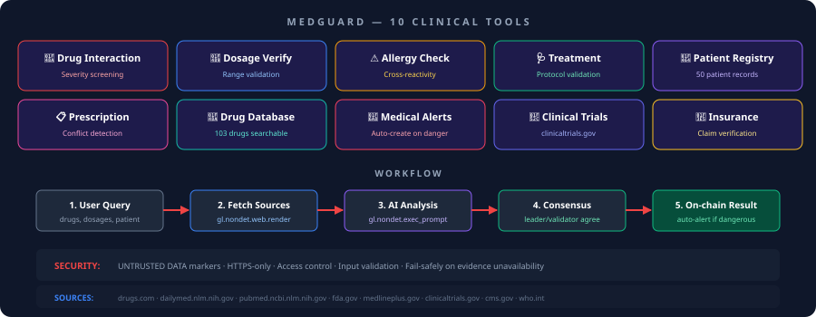
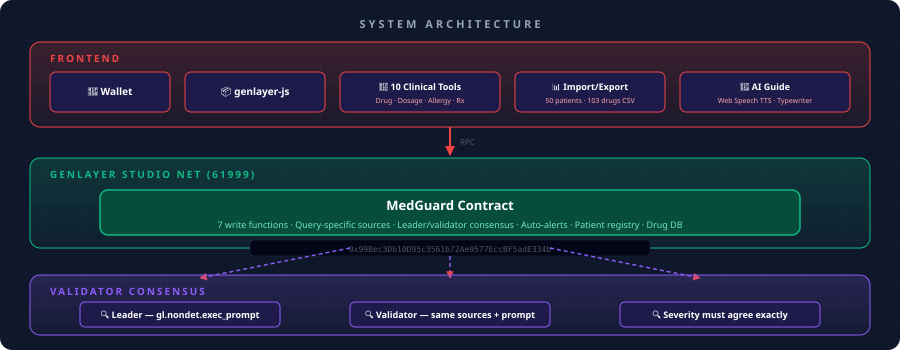

<div align="center">

# MedGuard

### Clinical Decision Support Oracle on GenLayer

[](https://explorer-studio.genlayer.com/address/0x2916Ec2952B83210B6c02f3D00E3CC2452Be4703)
[](LICENSE)
[](https://genlayer-medguard.vercel.app)

AI-powered on-chain platform with **10 clinical tools** — drug interaction, dosage verification, allergy cross-check, treatment validation, patient registry, prescription verification, drug database, medical alerts, clinical trial matching, and insurance claim verification.

<br/>

[**🚀 Live App**](https://genlayer-medguard.vercel.app) · [**🔍 Explorer**](https://explorer-studio.genlayer.com/address/0x2916Ec2952B83210B6c02f3D00E3CC2452Be4703) · [**📄 Contract**](contracts/medguard.py)

</div>

---

## 10 Clinical Tools



| Tool | Function | Consensus |
|:-----|:---------|:----------|
| 💊 **Drug Interaction** | Screen drug-drug interactions for severity | Leader/validator agree on severity |
| 💉 **Dosage Verification** | Verify dosages against clinical guidelines | Leader/validator agree on safety level |
| ⚠️ **Allergy Cross-Check** | Assess allergy risk for medication lists | Leader/validator agree on risk level |
| 🩺 **Treatment Validation** | Validate treatment against protocols | Leader/validator agree on compliance |
| 👤 **Patient Registry** | Register and manage patient records | Access-controlled CRUD |
| 📋 **Prescription Verification** | Verify prescriptions with conflict detection | Leader/validator agree on status |
| 💊 **Drug Database** | Searchable 103-drug pharmaceutical catalog | Read-only search |
| 🚨 **Medical Alerts** | Auto-create alerts on dangerous findings | Automatic on severity ≥ MAJOR |
| 🔬 **Clinical Trial Matching** | Match patients to clinicaltrials.gov | Leader/validator agree on trials |
| 🏥 **Insurance Claim Verification** | Verify insurance claim coverage | Leader/validator agree on verdict |

---

## Architecture



---

## How It Works

```
User Query → Fetch Sources → AI Analysis → Consensus → On-chain Result
   │              │               │            │             │
   │         gl.nondet.      gl.nondet.    leader +     auto-alert
   │         web.render      exec_prompt   validator    if dangerous
   │         (HTTPS only)    (JSON out)    agree
   │
   └─ drugs, dosages, patient info
```

| Step | What Happens |
|:-----|:-------------|
| **1. User Query** | Submit drugs, dosages, or patient info |
| **2. Fetch Sources** | Contract fetches from query-specific authoritative sources via `gl.nondet.web.render` |
| **3. AI Analysis** | AI analyzes via `gl.nondet.exec_prompt` with JSON output |
| **4. Consensus** | Leader/validator pattern via `gl.vm.run_nondet_unsafe` — severity must agree exactly |
| **5. On-chain Result** | Result stored on-chain, auto-alert created if dangerous |

---

## Contract

```
0x2916Ec2952B83210B6c02f3D00E3CC2452Be4703  (StudioNet 61999)
```

### Write Functions (7 — all use leader/validator consensus)
```python
check_drug_interaction(drug_a, drug_b, context, urls)
check_dosage(drug, dose_mg, unit, age, weight, context, urls)
check_allergy_risk(medications_csv, allergies_csv, context, urls)
validate_treatment(condition, treatment, context, urls)
verify_prescription(patient_id, drug, dose, freq, context, urls)
match_clinical_trial(condition, context, urls)
verify_insurance_claim(insurance, treatment, context, urls)
```

### Read Functions
```python
search_drugs(query)              # Search 103-drug database
get_check(check_id)              # Get any result by ID
get_patient(patient_id)          # Get patient record
get_prescription(rx_id)          # Get prescription
get_drug_info(drug_name)         # Get drug details
get_alert(alert_id)              # Get alert
get_alerts_for_patient(pid)      # Get patient alerts
get_trusted_sources()            # List authoritative sources
get_stats()                      # System analytics
```

---

## Security

| Feature | Implementation |
|:--------|:---------------|
| **UNTRUSTED DATA markers** | All fetched content marked untrusted in prompts |
| **HTTPS-only sources** | `_clean_urls` rejects non-HTTPS URLs |
| **Access control** | Patient updates restricted to registrant or owner |
| **Input validation** | All functions validate name lengths, CSV formats, ranges |
| **Fail-safely** | Returns UNAVAILABLE when evidence cannot be fetched |
| **Query-specific sources** | Each tool fetches from category-specific authoritative databases |

---

## Project Structure

```
medguard/
├── contracts/
│   └── medguard.py              # Intelligent contract (Python)
├── frontend/
│   ├── src/
│   │   ├── App.tsx              # Main UI — 10 clinical tools
│   │   ├── useGenLayer.ts       # genlayer-js client hooks
│   │   ├── useWallet.ts         # Wallet connection
│   │   └── importExport.ts      # CSV/JSON import/export
│   ├── public/
│   │   ├── sample_patients.json # 50 patient records
│   │   └── sample_drugs.json    # 103 drug database
│   └── package.json             # genlayer-js
├── tests/
│   └── test_medguard.py         # Contract tests
├── docs/
│   ├── tools.svg                # 10 clinical tools diagram
│   └── architecture.svg         # System architecture
└── README.md
```

---

## Quick Start

### Prerequisites
- OKX or MetaMask wallet
- GEN tokens on StudioNet (chain `61999`)

### Run Locally
```bash
git clone https://github.com/Jinchainne/medguard.git
cd medguard/frontend
npm install
npm run dev
```

### Run Tests
```bash
python -m pytest tests/ -v
```

---

## Key Design Decisions

| Decision | Rationale |
|:---------|:----------|
| **Query-specific sources** | Each clinical tool fetches from relevant authoritative databases, not a flat generic list |
| **Fail-safely** | Returns UNAVAILABLE when clinical evidence cannot be fetched — never guesses |
| **Leader/validator consensus** | 7 write functions use `gl.vm.run_nondet_unsafe` — severity must agree exactly |
| **Schema as str** | All view functions return JSON strings for reliable cross-SDK compatibility |
| **waitForTransactionReceipt** | Frontend waits for tx finality before reading result IDs |
| **UNTRUSTED DATA markers** | All fetched content marked untrusted — AI ignores instructions inside it |

---

<div align="center">

**Built on [GenLayer](https://genlayer.com)** · [MIT License](LICENSE)

</div>
