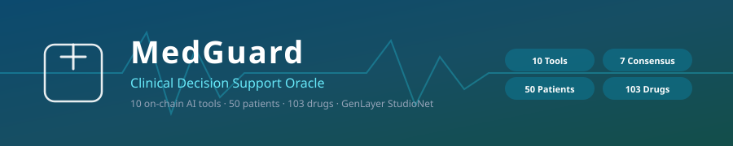
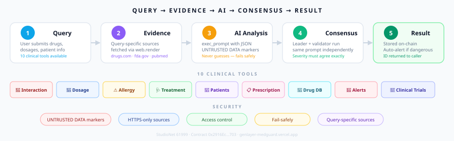

<div align="center">



[](https://explorer-studio.genlayer.com/address/0x99Bec3Db10D95c3561b72Ae9577EccBF5adE334b)
[](LICENSE)
[](https://genlayer-medguard.vercel.app)

<br/>

**AI-powered on-chain clinical decision support with 10 tools, real GEN consensus, fail-safe evidence handling, and a durable on-chain decision ledger.**

[Live App](https://genlayer-medguard.vercel.app) · [Explorer](https://explorer-studio.genlayer.com/address/0xE5982D885c14CD1fBEF1791cCEdd93Ac4676E523) · [Deploy Tx](https://explorer-studio.genlayer.com/tx/0x18dee1d4d2c3a55544d43f63f51693ae3aba01d99e75a2e09ab8e4d8557be08e) · [Contract](contracts/medguard.py) · [Milestones](docs/milestones/phase-1-consensus-security.md) · [Changelog](CHANGELOG.md)

</div>

---

## Workflow



---

## Tools

| # | Tool | What it checks | Evidence source |
|:-:|:-----|:---------------|:----------------|
| 1 | **Drug Interaction** | Severity between two drugs | drugs.com · dailymed · pubmed |
| 2 | **Dosage Verification** | Safe range by age/weight | medlineplus · fda.gov · dailymed |
| 3 | **Allergy Cross-Check** | Cross-reactivity risk | drugs.com · medlineplus |
| 4 | **Treatment Validation** | Protocol compliance | pubmed · who.int · fda.gov |
| 5 | **Patient Registry** | 50-patient CRUD with allergies/conditions | — |
| 6 | **Prescription Verification** | Conflict detection against patient record | medlineplus · fda.gov · dailymed |
| 7 | **Drug Database** | Searchable 103-drug catalog | — |
| 8 | **Medical Alerts** | Auto-created when severity ≥ MAJOR | — |
| 9 | **Clinical Trial Matching** | Patient-to-trial matching | clinicaltrials.gov · pubmed |
| 10 | **Insurance Claim** | Coverage verdict | cms.gov · fda.gov |

---

### v2.2 upgrade: durable clinical decision ledger

History is now loaded from the contract for the connected wallet through `get_checks_for_caller`. Results survive browser refreshes, device changes, and cleared local storage; the existing session history remains a responsive fallback while the chain read is pending.

## Consensus

Every write function uses **leader/validator** pattern:

```
┌─────────────┐     ┌─────────────┐
│   Leader    │     │  Validator  │
│  (author)   │     │ (independent│
│             │     │             │
│ 1. Fetch    │     │ 1. Fetch    │
│    sources  │     │    same     │
│ 2. AI       │     │    sources  │
│    analyze  │     │ 2. AI       │
│ 3. Return   │     │    analyze  │
│    result   │     │ 3. Compare  │
└──────┬──────┘     └──────┬──────┘
       │                   │
       └───────┬───────────┘
               ▼
     ┌─────────────────┐
     │   Must agree    │
     │   on severity   │
     │   exactly       │
     └────────┬────────┘
              ▼
        On-chain result
        + auto-alert
```

**Severity must match exactly** — patient safety is non-negotiable.

---

## Security

| Layer | Protection |
|:------|:-----------|
| **Data** | UNTRUSTED DATA markers in every prompt |
| **Network** | HTTPS-only — `_clean_urls` rejects non-HTTPS |
| **Access** | Patient updates locked to registrant + owner |
| **Input** | Name length, CSV format, range validation |
| **Evidence** | Fail-safely — returns UNAVAILABLE when sources down |
| **Sources** | Reserved budgets — user pages cannot crowd out clinical databases |
| **Quorum** | At least one authoritative clinical source must be fetched |
| **Prompt integrity** | Exact safety canary required across all 7 AI workflows |

---

## Contract

```
0xE5982D885c14CD1fBEF1791cCEdd93Ac4676E523  (StudioNet 61999, medguard/2.2.0)
```

### Clinical Consensus Writes (7 — all use leader/validator)
```
check_drug_interaction(drug_a, drug_b, context, urls)
verify_dosage(drug, dose_mg, weight_kg, age_years, urls)
check_allergy_risk(medications_csv, allergies_csv, context, urls)
validate_treatment(condition, treatment, context, urls)
verify_prescription(patient_id, medications_csv, notes, urls)
match_clinical_trial(condition, context, urls)
verify_insurance_claim(treatment, cost_cents, provider, context, urls)
```

### Reads (9)
```
search_drugs(query)           get_check(check_id)
get_patient(patient_id)       get_prescription(rx_id)
get_drug_info(drug_name)      get_alert(alert_id)
get_alerts_for_patient(pid)   get_trusted_sources()
get_stats()
```

---

## How a clinical check works

1. Connect an EIP-1193 wallet to StudioNet (`chainId 61999`).
2. Choose a tool and enter clinical inputs. User URLs are HTTPS-only and bounded before becoming prompt evidence.
3. The browser signs a real contract transaction and waits for GenLayer finality.
4. The leader fetches authoritative and user evidence, then returns a typed result.
5. Validators independently reproduce the decision through `run_nondet_unsafe`; malformed output or a failed safety canary is rejected.
6. The UI reads canonical state and stores the decision in the wallet-scoped on-chain ledger.

The frontend never treats a submitted hash as a completed decision. Results appear only after receipt acceptance and canonical contract readback.

## Useful contract reads

| Method | Purpose |
| --- | --- |
| `get_check(id)` | Retrieve a complete consensus decision |
| `get_checks_for_caller(address)` | Retrieve the caller's durable decision ledger |
| `get_patient(id)` | Read a registered patient record |
| `get_alerts_for_patient(id)` | Read patient-scoped safety alerts |
| `get_stats()` | Read aggregate counters and source configuration |

## Troubleshooting

**Wrong network:** switch to StudioNet, chain `61999`, RPC `https://studio.genlayer.com/api`, symbol `GEN`.

**Pending transaction:** keep the wallet open while validators reach consensus. Do not resubmit until the first transaction is finalized or failed.

**Empty history:** connect the same wallet that submitted the check. The ledger is scoped by caller address, not browser session.

**Unavailable source:** the contract fails safely with an unavailable/needs-review result. Missing evidence must never be treated as clinical clearance.

## Medical safety boundary

MedGuard is a clinical decision-support demonstration, not a diagnostic service or replacement for a licensed clinician. Do not use it for emergency decisions, autonomous prescribing, or unsupervised treatment. Every output requires qualified professional review.

## Contributing

Keep contract schema boundaries typed, preserve untrusted-source markers, and add behavioral tests for authorization, malformed model output, source failure, and persistence changes. Before opening a pull request, run the complete verification commands above and document any StudioNet transaction evidence.

---

## Project

```
medguard/
├── contracts/
│   └── medguard.py              # Intelligent contract
├── frontend/
│   ├── src/
│   │   ├── App.tsx              # 10-tool clinical UI
│   │   ├── useGenLayer.ts       # genlayer-js client
│   │   ├── useWallet.ts         # Wallet connection
│   │   └── importExport.ts      # CSV/JSON import/export
│   ├── public/
│   │   ├── sample_patients.json # 50 patient records
│   │   └── sample_drugs.json    # 103-drug database
│   └── package.json
├── deployments/
│   └── studionet.json           # Address + deployment proof
├── tests/
│   ├── test_medguard.py
│   └── test_consensus_security.py
├── docs/
│   ├── banner.svg               # Header banner
│   ├── workflow.svg             # Workflow diagram
│   ├── tools.svg                # 10 tools diagram
│   ├── architecture.svg         # Architecture
│   └── milestones/              # Reviewable milestone evidence
├── CHANGELOG.md
└── README.md
```

---

## Run

```bash
git clone https://github.com/Jinchainne/medguard.git
cd medguard/frontend
npm install && npm run dev
```

```bash
python -m pytest tests/ -v
```

---

<div align="center">

**Built on [GenLayer](https://genlayer.com)** · [MIT](LICENSE)

</div>
